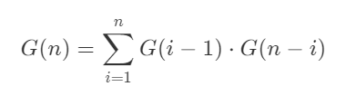
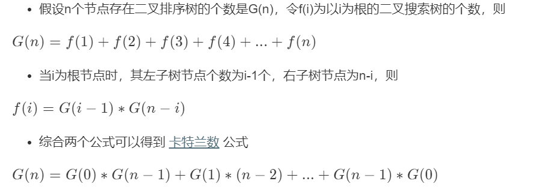

#### [96. 不同的二叉搜索树](https://leetcode-cn.com/problems/unique-binary-search-trees/)

给定一个整数 *n*，求以 1 ... *n* 为节点组成的二叉搜索树有多少种？

以1...n为节点组成的二叉搜索树的个数是一个卡特兰数。

**卡特兰数的递推公式**



**公式推导过程**



**代码**

```java
    public int generateTrees(int n) {
        int[] dp = new int[n+1];
        dp[0] = 1;
        dp[1] = 1;
        //求G(n)
        for (int i = 2; i <= n; i++) {
            //公式的表示
            for (int j = 1; j <=i ; j++) {
                dp[i] += dp[j-1] * dp[i-j];
            }
        }
        return dp[n];
    }
```

